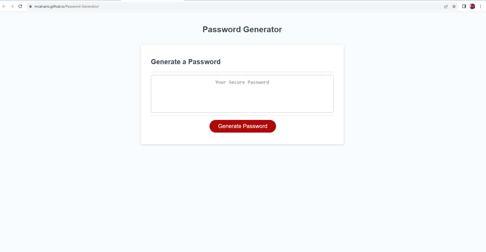

# Password-Generator

## Description
As a full stack developer with access to sensitive data, I want to randomly generate a password that meets certain criteria so that I can create a strong password that provides greater security.

# Usage
To use this application to obtain a new and secure password, click the button to generate a password.  You will be presented with a series of prompts for password criteria.  When prompted for password criteria, select which criteria to include in the password.  When prompted for the length of the password, choose a length of at least 8 characters and no more than 128 characters.  When asked for character types to include in the password, confirm whether or not to include lowercase, uppercase, numeric, and/or special characters.  After you answer each prompt, your input will be validated and at least one character type should be selected.  When all prompts are answered, a password is generated that matches the selected criteria.  The password will then be displayed on the page.

# Live Site Application
[Link to Live Site] https://mcalvario.github.io/Password-Generator/
[Screenshot of application]
[Link to updated portfolio] https://mcalvario.github.io/Professional-Portfolio/

# Credits
Youtube Password Generator: https://www.youtube.com/watch?v=x4HUaiazDes
Mosh: https://forum.codewithmosh.com/t/creating-a-password-generator-using-javascript/18971
geeksforgeeks.org: https://www.geeksforgeeks.org/how-to-generate-a-random-password-using-javascript/

# license

Copyright (c) [2023] [Password-Generator]

Permission is hereby granted, free of charge, to any person obtaining a copy
of this software and associated documentation files (the "Software"), to deal
in the Software without restriction, including without limitation the rights
to use, copy, modify, merge, publish, distribute, sublicense, and/or sell
copies of the Software, and to permit persons to whom the Software is
furnished to do so, subject to the following conditions:

The above copyright notice and this permission notice shall be included in all
copies or substantial portions of the Software.

THE SOFTWARE IS PROVIDED "AS IS", WITHOUT WARRANTY OF ANY KIND, EXPRESS OR
IMPLIED, INCLUDING BUT NOT LIMITED TO THE WARRANTIES OF MERCHANTABILITY,
FITNESS FOR A PARTICULAR PURPOSE AND NONINFRINGEMENT. IN NO EVENT SHALL THE
AUTHORS OR COPYRIGHT HOLDERS BE LIABLE FOR ANY CLAIM, DAMAGES OR OTHER
LIABILITY, WHETHER IN AN ACTION OF CONTRACT, TORT OR OTHERWISE, ARISING FROM,
OUT OF OR IN CONNECTION WITH THE SOFTWARE OR THE USE OR OTHER DEALINGS IN THE
SOFTWARE.

